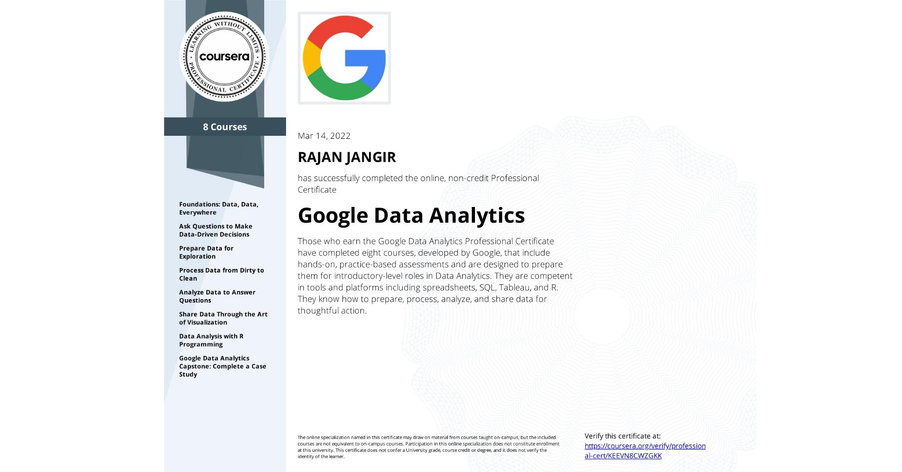

## [Google Data Analytics Professional Certificate](https://www.coursera.org/professional-certificates/google-data-analytics)

# Course Certificates Completed
- Foundations: Data, Data, Everywhere
- Prepare Data for Exploration
- Share Data Through the Art of Visualization
- Analyze Data to Answer Questions
- Data Analysis with R Programming
- Ask Questions to Make Data-Driven Decisions
- Process Data from Dirty to Clean
- Google Data Analytics Capstone: Complete a Case Study

